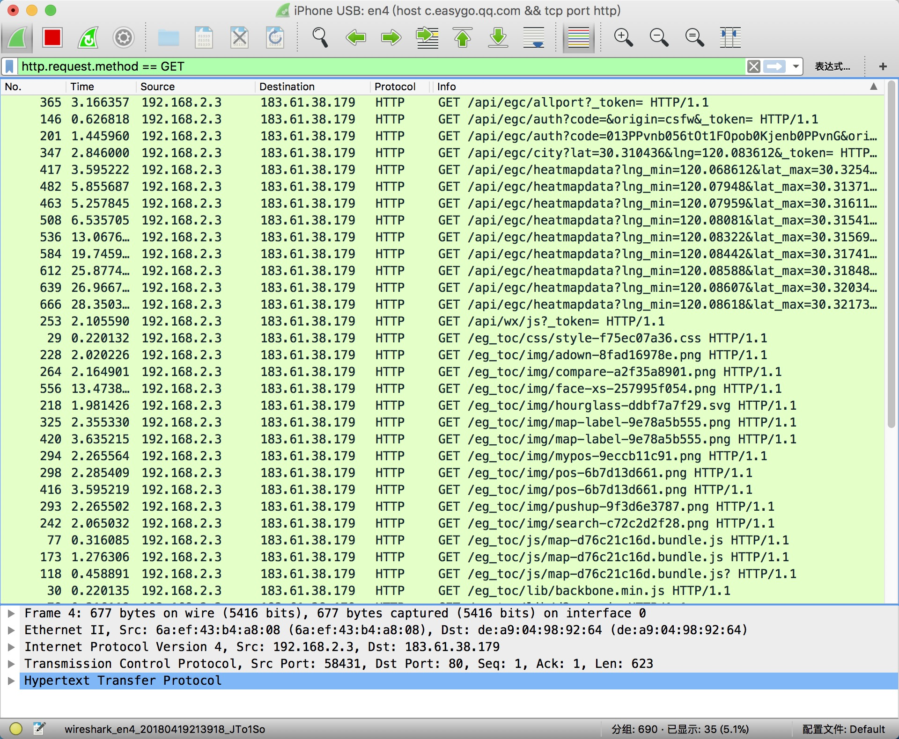
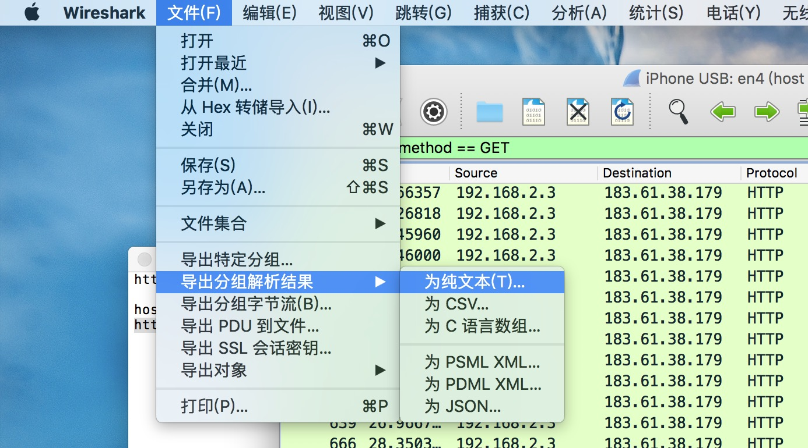

## **杭州市地图构建**

本地图包含了杭州市西湖区部分的道路交通地图和热力图信息，数据来源来自百度地图开放平台API。

------

###2018.4.21日更新

提供了紫金港到城西银泰这一片区域预处理好的热力图数据（一共两份，分别在中午和晚上时候获取），在release中的heatmap.zip文件中给出，同样的有csv风格的栅格地图文件，每个数字代表的含义下面有说明。

下载地址：https://github.com/AlanShaw-GitHub/Hangzhou-map/releases/tag/v1.0


------

本数据有两份地图，一份为道路地图，一份为热力图地图（随时间变化）。这两份地图均为栅格地图，坐标信息完全一致。地图的每个点的数值都有特殊数字表明该点的性质。下面一一介绍这两份地图的详细信息。

### 道路地图

道路地图对不同道路种类进行了细分，包括：

- 高速、国道、铁路（红色，栅格地图中为1）
- 城市道路和地铁（黑色，栅格地图中为2）
- 普通道路（蓝色，栅格地图中为3）
- 什么也不是（对应图中白色，，栅格地图中为0）

放出的地图道路数据包含两个格式的文件：
下载地址：https://github.com/AlanShaw-GitHub/Hangzhou-map/releases/tag/v1.0

- csv风格的二维数组，同一行元素以逗号隔开，每一行之间用换行符隔开
- opencv风格的二维数组，同一行元素以逗号隔开，每一行之间用分号（;）隔开


#### 热力图

热力图有四档，由低到高分别对应了该点人流量的多少，在栅格地图中，分别为0-3这三个数字。在图片中，分别为蓝色、淡蓝色和绿色。热力图是通过百度地图在不同时间的数据进行截取分析生成，所以在一天的不同时刻热力图的分布是不同的。我们会在不同时间段对图片进行截取分析。

下载地址：https://github.com/AlanShaw-GitHub/Hangzhou-map/releases/tag/v1.0

以下从低到高：

- 蓝色（栅格地图中为1）
- 淡蓝色（栅格地图中为2）
- 绿色（栅格地图中为3）
- 红色（栅格地图中为4）
- 黑色，什么也不是（栅格地图中为0）

#### 技术相关

道路地图的生成采用了百度地图开放平台JavaScript API（底图编辑工具），对道路的颜色进行更改，方便后期识别。拼接多张图片采用Photoshop进行。

热力图是百度地图手机版的一个功能，该功能只在手机端app提供。难点在于将热力图的部分准确识别出来并去除底图（那些道路和文字信息），我们采用了opencv3对图像进行处理，得到了很好的结果。

#### 关于从手机百度地图的热力图功能提取热力图的方法详解

提取热力图有很多难点，主要是热力图是在原地图之上添加进去的，所以热力图和原地图参杂在一起，很难分开，原地图各个位置还都是可变的，我们采用了opencv3进行操作，关于如何配置opencv环境，网上有很多教程，也可以参考我的这篇博客：http://www.alanshaw.cn/articles/opencv-demo.html ，这涉及到一些基础的图像处理知识，如果不想管这些，直接运行我们的代码即可。

基本原理是把带热力图的图片减去不带热力图的图片，就可以提取出多出来的特征，多次减乘减乘，一步步提取。然后再用图像卷积（腐蚀卷积、膨胀卷积）多次，得到最终热力图。**所以如果你要自己制作这个热力图，你需要用手机打开百度地图，在开启热力图和不开启的情况下分别截屏，然后保存。因为一次只能截屏一个小范围，所以要后期用ps等工具拼接起来。**（百度“ps拼接图片”有很多教程，这里就不说了）


代码解释：代码开头那三个地址都要改成自己的目录文件，img代表了带热力图的地图图片，img1代表了不带热力图的地图图片（**注意：1.这两张图片一定要对齐！即两张图片要表示同一个地点，只是有无热力图的区别**，建议在截图时就在有开启热力图的时候截一张，然后原地不动，没有热力图的时候截屏一张，2.**要把上面下面裁剪掉一部分，主要是右下角有+-号，左下角有定位标志，上面有状态栏等等，不删掉的话不好处理**，我们是采用lr批量裁剪掉，很方便）。out就表示输出的图片地址。

```c++
#include <iostream>
#include <opencv2/opencv.hpp>
using namespace std;
using namespace cv;

int main() {
    Mat img,img1,out;
    img = imread("/Users/alan/Desktop/1.png");
    img1 = imread("/Users/alan/Desktop/2.png");
    String outpath("/Users/alan/Desktop/out.png");
    for (int i = 0;i < img.rows;i++)
        for(int j = 0;j(i,j) = img.at<Vec3b>(i,j)-0.7*img1.at<Vec3b>(i,j);
            img.at<Vec3b>(i,j) = img.at<Vec3b>(i,j)*2;
            img.at<Vec3b>(i,j) = img.at<Vec3b>(i,j)-0.2*img1.at<Vec3b>(i,j);
            img.at<Vec3b>(i,j) = img.at<Vec3b>(i,j)*5;
            img.at<Vec3b>(i,j) = img.at<Vec3b>(i,j)-0.33*img1.at<Vec3b>(i,j);
            img.at<Vec3b>(i,j) = img.at<Vec3b>(i,j)*2;
            img.at<Vec3b>(i,j) = img.at<Vec3b>(i,j)-0.33*img1.at<Vec3b>(i,j);
            img.at<Vec3b>(i,j) = img.at<Vec3b>(i,j)*2;
        };
    Mat element = getStructuringElement(MORPH_RECT,Size(15,15));
    Mat element1 = getStructuringElement(MORPH_RECT,Size(25,25));
    erode(img,img,element);
    erode(img,img,element);
    erode(img,img,element);
    dilate(img,img,element);
    dilate(img,img,element);
    dilate(img,img,element);
    dilate(img,img,element);
    erode(img,img,element);
    //erode(img,img,element);
    for (int i = 0;i < img.rows;i++)
        for(int j = 0;j(i,j)[0] <230 && img.at<Vec3b>(i,j)[0] >100 && img.at<Vec3b>(i,j)[2] < 50)
                img.at<Vec3b>(i,j) = Vec3b(255,0,0);
        };

    imwrite(outpath,img);
    return 0;
}
```


### 宜出行热力图数据

微信-钱包-城市服务-城市热力图也可以看热力图，但是为了反爬，该热力图对每天可以访问的次数有限制。可以依据以下步骤后去该热力图信息：

1. 用电脑开热点给手机，这样将手机的流量重定向经过电脑，方便电脑对手机的网络流量进行截取分析。
2. 电脑端下载一个http嗅探软件（如wireshark），设置过滤器捕获规则（如在wireshark中，规则为`host c.easygo.qq.com && tcp port http`，这样可以截取发往宜出行的http请求流量，然后再设置过滤规则`为http.request.method == GET`，获取宜出行的http GET报文，然后导出即可。

导出后的数据像这样：

```
      9 0.100841       192.168.2.3           183.61.38.179         HTTP     1186   GET /api/egc/heatmapdata?lng_min=120.07981&lat_max=30.32197&lng_max=120.09590&lat_min=30.29926&level=15&city=%E6%9D%AD%E5%B7%9E&lat=undefined&lng=undefined&_token= HTTP/1.1 

Frame 9: 1186 bytes on wire (9488 bits), 1186 bytes captured (9488 bits) on interface 0
Ethernet II, Src: 6a:ef:43:b4:a8:08 (6a:ef:43:b4:a8:08), Dst: de:a9:04:98:92:64 (de:a9:04:98:92:64)
Internet Protocol Version 4, Src: 192.168.2.3, Dst: 183.61.38.179
Transmission Control Protocol, Src Port: 49357, Dst Port: 80, Seq: 1, Ack: 1, Len: 1132
Hypertext Transfer Protocol

     26 0.928505       192.168.2.3           183.61.38.179         HTTP     1184   GET /api/egc/heatmapdata?lng_min=120.07556&lat_max=30.32816&lng_max=120.09165&lat_min=30.30545&level=15&city=%E6%9D%AD%E5%B7%9E&lat=undefined&lng=undefined&_token= HTTP/1.1 

Frame 26: 1184 bytes on wire (9472 bits), 1184 bytes captured (9472 bits) on interface 0
Ethernet II, Src: 6a:ef:43:b4:a8:08 (6a:ef:43:b4:a8:08), Dst: de:a9:04:98:92:64 (de:a9:04:98:92:64)
Internet Protocol Version 4, Src: 192.168.2.3, Dst: 183.61.38.179
Transmission Control Protocol, Src Port: 49363, Dst Port: 80, Seq: 1, Ack: 1, Len: 1130
Hypertext Transfer Protocol

     58 1.616645       192.168.2.3           183.61.38.179         HTTP     1186   GET /api/egc/heatmapdata?lng_min=120.07114&lat_max=30.31812&lng_max=120.08723&lat_min=30.29541&level=15&city=%E6%9D%AD%E5%B7%9E&lat=undefined&lng=undefined&_token= HTTP/1.1 

Frame 58: 1186 bytes on wire (9488 bits), 1186 bytes captured (9488 bits) on interface 0
Ethernet II, Src: 6a:ef:43:b4:a8:08 (6a:ef:43:b4:a8:08), Dst: de:a9:04:98:92:64 (de:a9:04:98:92:64)
Internet Protocol Version 4, Src: 192.168.2.3, Dst: 183.61.38.179
Transmission Control Protocol, Src Port: 49365, Dst Port: 80, Seq: 1, Ack: 1, Len: 1132
Hypertext Transfer Protocol
```

提供以下python代码洗数据（把对应的文件名替换成你自己的）：

```python
import re

file = open('/Users/alan/Desktop/source.txt', 'r')
out = open('/Users/alan/Desktop/out.txt','w')
line = file.readlines()
data = ''
for i in line:
    data = data + i
pattern = re.compile(r'lng_min=[0-9.]+&lat_max=[0-9.]+&lng_max=[0-9.]+&lat_min=[0-9.]+&level=15')
lists = pattern.findall(data)
for i in lists:
    out.write(i+'\n')
```

洗完数据后的数据如下（lng和lat为经纬度）：

```
lng_min=120.07981&lat_max=30.32197&lng_max=120.09590&lat_min=30.29926&level=15
lng_min=120.07556&lat_max=30.32816&lng_max=120.09165&lat_min=30.30545&level=15
lng_min=120.07114&lat_max=30.31812&lng_max=120.08723&lat_min=30.29541&level=15
lng_min=120.07256&lat_max=30.28969&lng_max=120.08865&lat_min=30.26697&level=15
lng_min=120.08200&lat_max=30.29799&lng_max=120.09809&lat_min=30.27528&level=15
lng_min=120.08629&lat_max=30.29662&lng_max=120.10239&lat_min=30.27390&level=15
lng_min=120.09299&lat_max=30.30711&lng_max=120.10908&lat_min=30.28439&level=15
lng_min=120.09664&lat_max=30.31600&lng_max=120.11273&lat_min=30.29329&level=15
lng_min=120.10316&lat_max=30.31737&lng_max=120.11925&lat_min=30.29466&level=15
```

下面是用wireshark进行一些操作的截图





