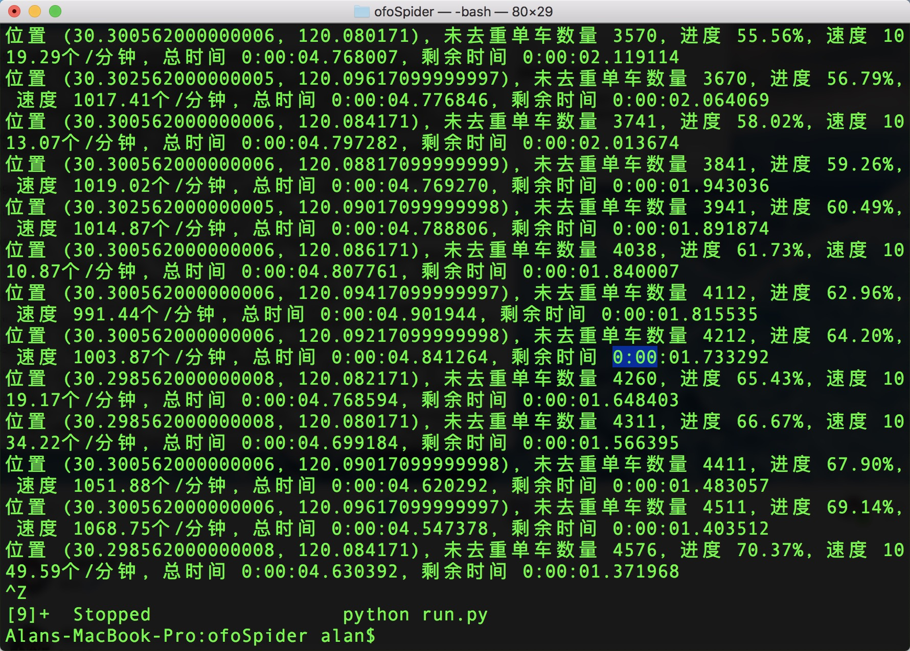
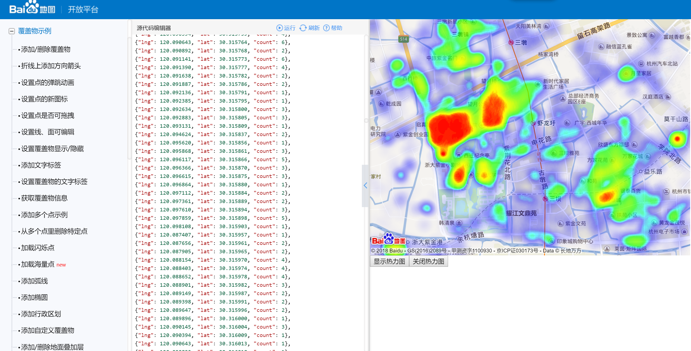
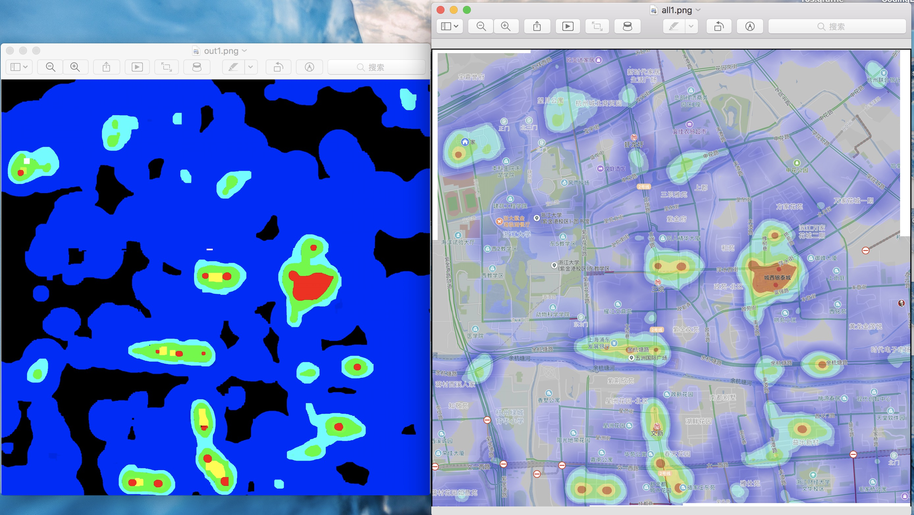
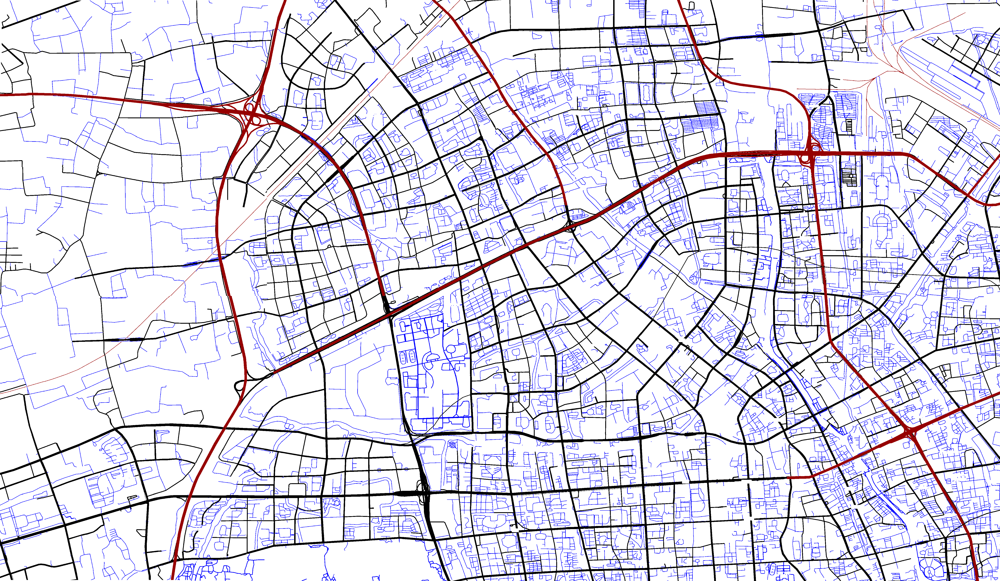
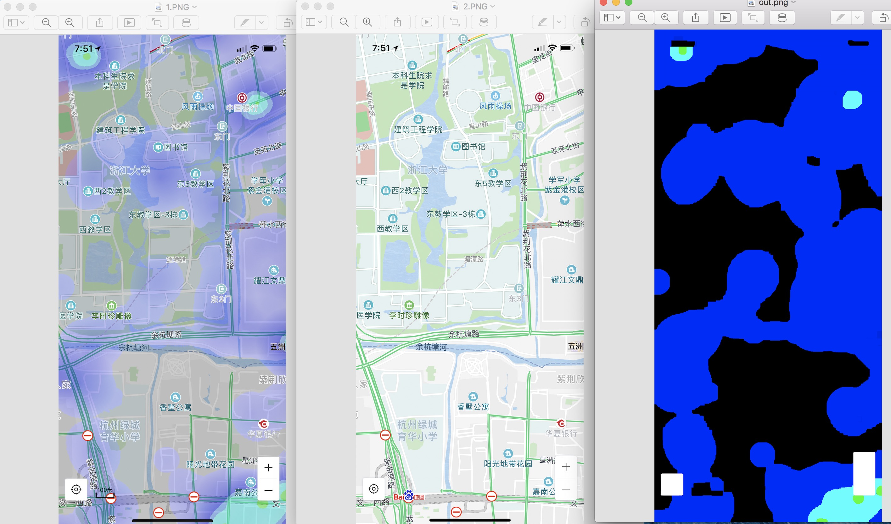
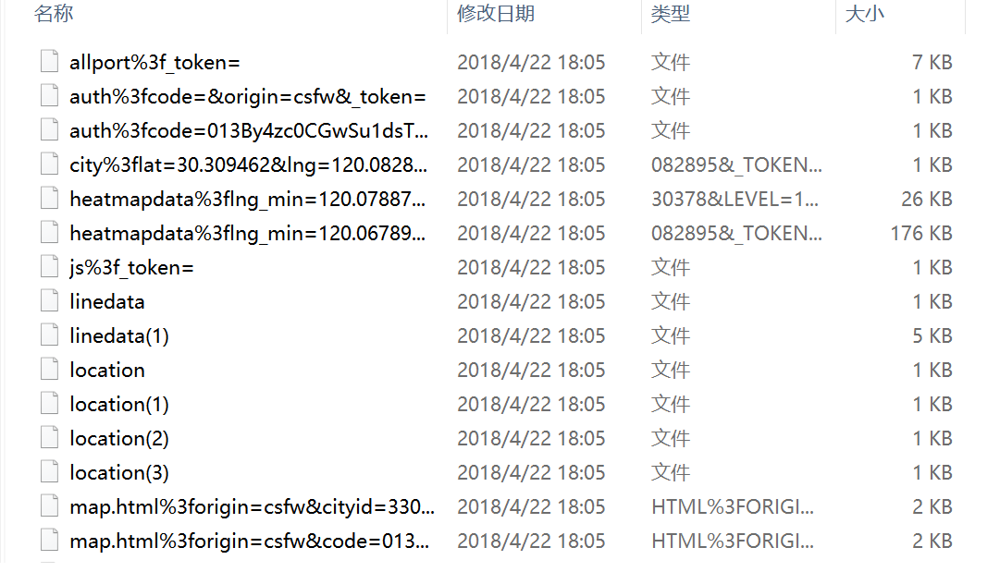
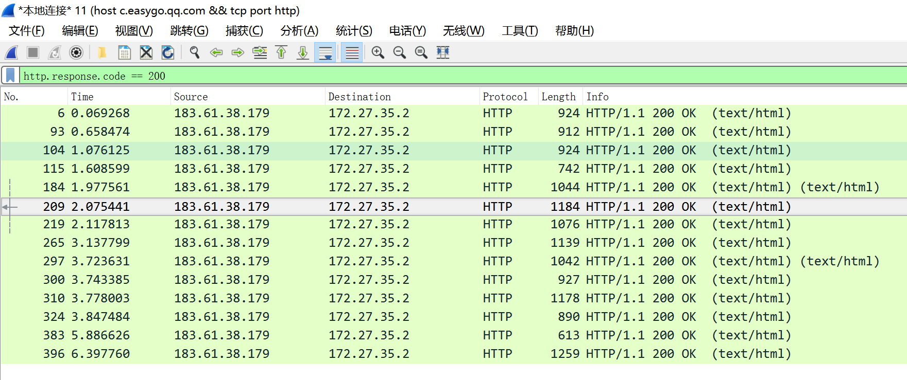
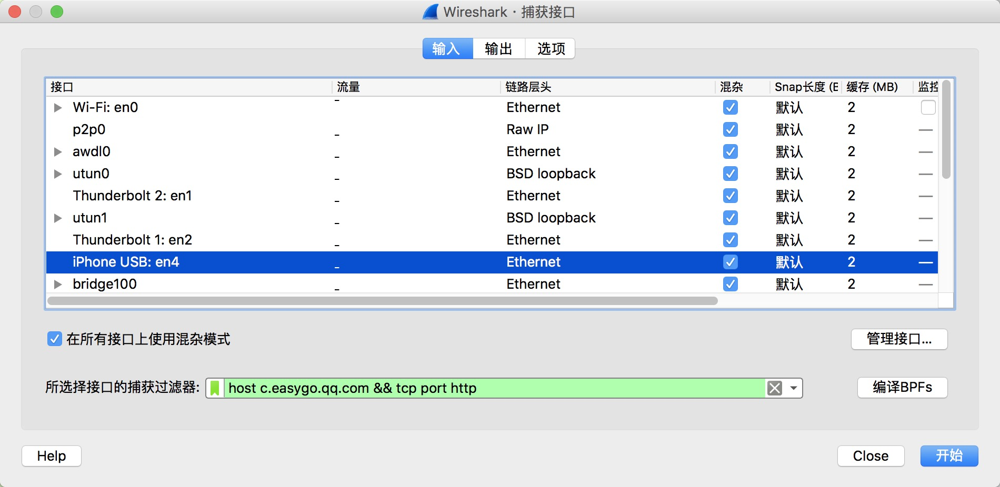

## **杭州市地图构建**

本地图包含了杭州市西湖区部分的道路交通地图和热力图信息，数据来源来自百度地图开放平台API。

------

### 2018.4.24日更新

更新了我们使用宜出行获取的数据，现在可以直接下载了现成数据了，以及ofo小黄车数据获取方法。

宜出行数据说明：是一个json文件，像下面这样：

```json
[{"lng": 120.12930453511079, "lat": 30.277986162784696, "count": 5}, {"lng": 120.13030537095595, "lat": 30.277982848990998, "count": 5}, {"lng": 120.13055561811741, "lat": 30.277981868949453, "count": 5}, {"lng": 120.13105615799329, "lat": 30.277979728091967, "count": 10}, {"lng": 120.13130645061517, "lat": 30.277978567642354, "count": 6}, {"lng": 120.13155675829371, "lat": 30.27797734744017, "count": 18}, {"lng": 120.13205741860726, "lat": 30.27797472862363, "count": 5}, {"lng": 120.13230777112916, "lat": 30.277973330457495, "count": 10}, {"lng": 120.1325581384814, "lat": 30.27797187343517, "count": 5}, {"lng": 120.13305891742272, "lat": 30.277968783829603, "count": 5}]
```

使用python的正确打开方式为：(处理完datas就是一个python列表，每一个元素是一个dict字典)

```python
import json
f = open('/path/to/file/easygo.json')
datas = f.read()
datas = json.loads(datas)
```

ofo小黄车数据获取方法：

https://github.com/SilverBooker/ofoSpider

按照这个教程操作即可，只是注册机暂时不能用了，用自己的账号还是小心点。其他步骤很简单，几分钟就搞好了。

以下是程序截图（你的还会出现token信息，为了保密我把它删了，所以看起来可能有些不一样）



------
### 2018.4.22日更新

更新了宜出行数据的获取方法，之前的有误。具体步骤在最下面。在windows、macos上用wireshark都可以抓包，并且还提供了源代码，源代码有几个功能：

- 可以将导出的json数据转换成经纬度坐标和热力值大小
- 火星坐标系->百度坐标系的转换
- 可以导出百度地图开放平台API绘制热力图的js代码，直接黏贴进去就可以做可视化



------

### 2018.4.21日更新

提供了紫金港到城西银泰这一片区域预处理好的热力图数据（一共两份，分别在中午和晚上时候获取），在release中的heatmap.zip文件中给出，同样的有csv风格的栅格地图文件，每个数字代表的含义下面有说明。

下载地址：https://github.com/AlanShaw-GitHub/Hangzhou-map/releases/tag/v1.0



------

本数据有两份地图，一份为道路地图，一份为热力图地图（随时间变化）。这两份地图均为栅格地图，坐标信息完全一致。地图的每个点的数值都有特殊数字表明该点的性质。下面一一介绍这两份地图的详细信息。

### 道路地图

道路地图对不同道路种类进行了细分，包括：

- 高速、国道、铁路（红色，栅格地图中为1）
- 城市道路和地铁（黑色，栅格地图中为2）
- 普通道路（蓝色，栅格地图中为3）
- 什么也不是（对应图中白色，，栅格地图中为0）

放出的地图道路数据包含两个格式的文件：
下载地址：https://github.com/AlanShaw-GitHub/Hangzhou-map/releases/tag/v1.0

- csv风格的二维数组，同一行元素以逗号隔开，每一行之间用换行符隔开
- opencv风格的二维数组，同一行元素以逗号隔开，每一行之间用分号（;）隔开



#### 热力图

热力图有四档，由低到高分别对应了该点人流量的多少，在栅格地图中，分别为0-3这三个数字。在图片中，分别为蓝色、淡蓝色和绿色。热力图是通过百度地图在不同时间的数据进行截取分析生成，所以在一天的不同时刻热力图的分布是不同的。我们会在不同时间段对图片进行截取分析。

下载地址：https://github.com/AlanShaw-GitHub/Hangzhou-map/releases/tag/v1.0

以下从低到高：

- 蓝色（栅格地图中为1）
- 淡蓝色（栅格地图中为2）
- 绿色（栅格地图中为3）
- 红色（栅格地图中为4）
- 黑色，什么也不是（栅格地图中为0）

#### 技术相关

道路地图的生成采用了百度地图开放平台JavaScript API（底图编辑工具），对道路的颜色进行更改，方便后期识别。拼接多张图片采用Photoshop进行。

热力图是百度地图手机版的一个功能，该功能只在手机端app提供。难点在于将热力图的部分准确识别出来并去除底图（那些道路和文字信息），我们采用了opencv3对图像进行处理，得到了很好的结果。

#### 关于从手机百度地图的热力图功能提取热力图的方法详解

提取热力图有很多难点，主要是热力图是在原地图之上添加进去的，所以热力图和原地图参杂在一起，很难分开，原地图各个位置还都是可变的，我们采用了opencv3进行操作，关于如何配置opencv环境，网上有很多教程，也可以参考我的这篇博客：http://www.alanshaw.cn/articles/opencv-demo.html ，这涉及到一些基础的图像处理知识，如果不想管这些，直接运行我们的代码即可。

基本原理是把带热力图的图片减去不带热力图的图片，就可以提取出多出来的特征，多次减乘减乘，一步步提取。然后再用图像卷积（腐蚀卷积、膨胀卷积）多次，得到最终热力图。**所以如果你要自己制作这个热力图，你需要用手机打开百度地图，在开启热力图和不开启的情况下分别截屏，然后保存。因为一次只能截屏一个小范围，所以要后期用ps等工具拼接起来。**（百度“ps拼接图片”有很多教程，这里就不说了）



代码解释：代码开头那三个地址都要改成自己的目录文件，img代表了带热力图的地图图片，img1代表了不带热力图的地图图片（**注意：1.这两张图片一定要对齐！即两张图片要表示同一个地点，只是有无热力图的区别**，建议在截图时就在有开启热力图的时候截一张，然后原地不动，没有热力图的时候截屏一张，2.**要把上面下面裁剪掉一部分，主要是右下角有+-号，左下角有定位标志，上面有状态栏等等，不删掉的话不好处理**，我们是采用lr批量裁剪掉，很方便）。out就表示输出的图片地址。

```c++
#include <iostream>
#include <opencv2/opencv.hpp>
using namespace std;
using namespace cv;

int main() {
    Mat img,img1,out;
    img = imread("/Users/alan/Desktop/1.png");
    img1 = imread("/Users/alan/Desktop/2.png");
    String outpath("/Users/alan/Desktop/out.png");
    for (int i = 0;i < img.rows;i++)
        for(int j = 0;j(i,j) = img.at<Vec3b>(i,j)-0.7*img1.at<Vec3b>(i,j);
            img.at<Vec3b>(i,j) = img.at<Vec3b>(i,j)*2;
            img.at<Vec3b>(i,j) = img.at<Vec3b>(i,j)-0.2*img1.at<Vec3b>(i,j);
            img.at<Vec3b>(i,j) = img.at<Vec3b>(i,j)*5;
            img.at<Vec3b>(i,j) = img.at<Vec3b>(i,j)-0.33*img1.at<Vec3b>(i,j);
            img.at<Vec3b>(i,j) = img.at<Vec3b>(i,j)*2;
            img.at<Vec3b>(i,j) = img.at<Vec3b>(i,j)-0.33*img1.at<Vec3b>(i,j);
            img.at<Vec3b>(i,j) = img.at<Vec3b>(i,j)*2;
        };
    Mat element = getStructuringElement(MORPH_RECT,Size(15,15));
    Mat element1 = getStructuringElement(MORPH_RECT,Size(25,25));
    erode(img,img,element);
    erode(img,img,element);
    erode(img,img,element);
    dilate(img,img,element);
    dilate(img,img,element);
    dilate(img,img,element);
    dilate(img,img,element);
    erode(img,img,element);
    //erode(img,img,element);
    for (int i = 0;i < img.rows;i++)
        for(int j = 0;j(i,j)[0] <230 && img.at<Vec3b>(i,j)[0] >100 && img.at<Vec3b>(i,j)[2] < 50)
                img.at<Vec3b>(i,j) = Vec3b(255,0,0);
        };

    imwrite(outpath,img);
    return 0;
}
```


### 宜出行热力图数据

微信-钱包-城市服务-城市热力图也可以看热力图，但是为了反爬，该热力图对每天可以访问的次数有限制。可以依据以下步骤后去该热力图信息：

1. 用电脑开热点给手机（如360wifi），这样将手机的流量重定向经过电脑，方便电脑对手机的网络流量进行截取分析。
2. 电脑端下载一个http嗅探软件（如wireshark），设置过滤器捕获规则（如在wireshark中，规则为`host c.easygo.qq.com && tcp port http`，这样可以截取发往宜出行的http请求流量，然后再设置过滤规则为`http.response.code == 200`，获取宜出行的http response报文，这时候在你感兴趣的区域移动，会自动抓包，然后抓完了点击停止，然后点击 文件->导出对象->HTTP..，指定一个文件夹保存那些json文件。

我们提供的代码还给出了使用百度地图开放平台API进行可视化的文件，网址是http://lbsyun.baidu.com/jsdemo.htm#c1_15

运行python代码，把txt文件复制进去，点击运行，点击显示热力图，就可以可视化。

导出后的文件夹像这样：




提供以下python代码洗数据（把对应的文件名替换成你自己的）：

```python
import os
import re
import json
import math

#如果要使用百度地图开放平台可视化，请指定导出的txt文件地址
output_path = '/Users/alan/Desktop/5.txt'
#这是存放wireshark导出的html文件的地址
html_path = '/Users/alan/Desktop/html'

#火星坐标系转百度坐标系
def gcj02tobd09(lng, lat):
    """
    火星坐标系(GCJ-02)转百度坐标系(BD-09)
    谷歌、高德——>百度
    :param lng:火星坐标经度
    :param lat:火星坐标纬度
    :return:
    """
    x_pi = 3.14159265358979324 * 3000.0 / 180.0
    z = math.sqrt(lng * lng + lat * lat) + 0.00002 * math.sin(lat * x_pi)
    theta = math.atan2(lat, lng) + 0.000003 * math.cos(lng * x_pi)
    bd_lng = z * math.cos(theta) + 0.0065
    bd_lat = z * math.sin(theta) + 0.006
    return bd_lng, bd_lat

files = os.listdir(html_path)
heatmaps = []
dicts = {}
for file in files:
    if re.search('heatmapdata',file):
        f = open(os.path.join(html_path,file))
        f = f.read()
        data = json.loads(f)['data']
        minimun = data[0]['count']
        for i in data:
            if minimun > i['count']:
                minimun = i['count']
        for i in data:
            count = int(i['count'] / minimun)
            k = dicts.get(str(i['grid_x']) + str(i['grid_y']), 'error')
            if k == 'error':
                dicts["%d%d" % (i['grid_x'], i['grid_y'])] = count
            else:
                dicts[str(i['grid_x']) + str(i['grid_y'])] = dicts[str(i['grid_x']) + str(i['grid_y'])] + count
print(len(dicts))
text = '''
<!DOCTYPE html>
<html>
<head>
    <meta http-equiv="Content-Type" content="text/html; charset=utf-8" />
    <meta name="viewport" content="initial-scale=1.0, user-scalable=no" />
    <script type="text/javascript" src="http://api.map.baidu.com/api?v=2.0&ak=您的密钥"></script>
    <script type="text/javascript" src="http://api.map.baidu.com/library/Heatmap/2.0/src/Heatmap_min.js"></script>
    <title>热力图功能示例</title>
    <style type="text/css">
		ul,li{list-style: none;margin:0;padding:0;float:left;}
		html{height:100%}
		body{height:100%;margin:0px;padding:0px;font-family:"微软雅黑";}
		#container{height:500px;width:100%;}
		#r-result{width:100%;}
    </style>	
</head>
<body>
	<div id="container"></div>
	<div id="r-result">
		<input type="button"  onclick="openHeatmap();" value="显示热力图"/><input type="button"  onclick="closeHeatmap();" value="关闭热力图"/>
	</div>
</body>
</html>
<script type="text/javascript">
    var map = new BMap.Map("container");          // 创建地图实例

    var point = new BMap.Point(120.095462, 30.312054);
    map.centerAndZoom(point, 15);             // 初始化地图，设置中心点坐标和地图级别
    map.enableScrollWheelZoom(); // 允许滚轮缩放

    var points =[
'''
text1 = '''
    ];

    if(!isSupportCanvas()){
    	alert('热力图目前只支持有canvas支持的浏览器,您所使用的浏览器不能使用热力图功能~')
    }
	//详细的参数,可以查看heatmap.js的文档 https://github.com/pa7/heatmap.js/blob/master/README.md
	//参数说明如下:
	/* visible 热力图是否显示,默认为true
     * opacity 热力的透明度,1-100
     * radius 势力图的每个点的半径大小   
     * gradient  {JSON} 热力图的渐变区间 . gradient如下所示
     *	{
			.2:'rgb(0, 255, 255)',
			.5:'rgb(0, 110, 255)',
			.8:'rgb(100, 0, 255)'
		}
		其中 key 表示插值的位置, 0~1. 
		    value 为颜色值. 
     */
	heatmapOverlay = new BMapLib.HeatmapOverlay({"radius":20});
	map.addOverlay(heatmapOverlay);
	heatmapOverlay.setDataSet({data:points,max:100});
	//是否显示热力图
    function openHeatmap(){
        heatmapOverlay.show();
    }
	function closeHeatmap(){
        heatmapOverlay.hide();
    }
	closeHeatmap();
    function setGradient(){
     	/*格式如下所示:
		{
	  		0:'rgb(102, 255, 0)',
	 	 	.5:'rgb(255, 170, 0)',
		  	1:'rgb(255, 0, 0)'
		}*/
     	var gradient = {};
     	var colors = document.querySelectorAll("input[type='color']");
     	colors = [].slice.call(colors,0);
     	colors.forEach(function(ele){
			gradient[ele.getAttribute("data-key")] = ele.value; 
     	});
        heatmapOverlay.setOptions({"gradient":gradient});
    }
	//判断浏览区是否支持canvas
    function isSupportCanvas(){
        var elem = document.createElement('canvas');
        return !!(elem.getContext && elem.getContext('2d'));
    }
</script>
'''

for coor,value in dicts.items():
    # http://c.easygo.qq.com/eg_toc/js/map-55f0ea7694.bundle.js
    lng = 1e-6 * (250.0 * int(coor[0:6]) + 125.0)
    lat = 1e-6 * (250.0 * int(coor[6:12]) + 125.0)
    lng,lat = gcj02tobd09(lng,lat)
    #print( '{"lng": %.6f, "lat": %.6f, "count": %d},' % (heatmap['lng'],heatmap['lat'],heatmap['count']))
    #print( '{"lng": %.6f, "lat": %.6f, "count": %d},' % (lng,lat,heatmap['count']))
    text = text + '{"lng": %.6f, "lat": %.6f, "count": %d},\n' % (lng,lat,value)

text = text[0:len(text)-1]
text = text + text1
f = open(output_path,'w')
f.write(text)
f.close()
```

下面是用wireshark进行一些操作的截图






